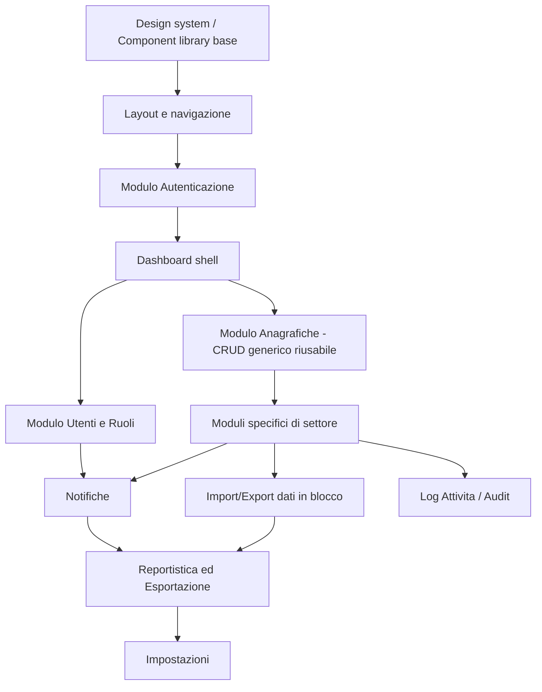

# Componenti Applicativi e Workflow di Sviluppo

## Moduli funzionali core (comuni a qualunque settore)

| Modulo | Descrizione | Priorità |
|---|---|---|
| Autenticazione & Onboarding | Login, registrazione, recupero password, eventuale onboarding organizzazione | Alta — primo modulo da costruire |
| Dashboard | Overview con KPI, grafici riepilogativi, notifiche recenti | Alta |
| Gestione Utenti & Ruoli | CRUD utenti, assegnazione ruoli/permessi (pannello admin) | Alta |
| Anagrafiche / Entità principale | Il "cuore" specifico del settore: clienti, prodotti, pazienti, studenti, spedizioni... | Alta |
| Documenti & Allegati | Upload, categorizzazione, versioning file | Media |
| Import/Export dati in blocco | Caricamento/scaricamento massivo (onboarding clienti, migrazioni) — dettagli in `07-import-export-dati.md` | Media |
| Notifiche | In-app, email, push (la PWA abilita le push native) | Media |
| Ricerca globale | Full-text search trasversale su più entità | Media |
| Reportistica & Esportazione | Generazione PDF, esportazione Excel/CSV | Media |
| Impostazioni | Configurazione organizzazione, preferenze utente, tema | Bassa/Media |
| Log Attività / Audit | Storico azioni per utente/entità | Media |
| Multi-tenancy | Solo se il gestionale deve servire più organizzazioni distinte sulla stessa istanza | Dipende dal progetto |

## Flusso di sviluppo dei componenti (ordine consigliato)

### Perché questo ordine

1. **Design system prima di tutto**: bottoni, input, modali, tabelle riutilizzabili — costruirli una volta evita duplicazioni e incoerenze visive in tutti i moduli successivi.
2. **Layout e navigazione**: la "cornice" (sidebar, header, routing) va decisa presto perché condiziona come si innestano i moduli successivi.
3. **Autenticazione prima della Dashboard**: senza autenticazione funzionante non si può proteggere nessuna rotta.
4. **Modulo Anagrafiche come CRUD generico riusabile**: conviene costruire un componente CRUD generico (tabella + form + modali di creazione/modifica/eliminazione) parametrizzabile, da riutilizzare per ogni entità specifica di settore invece di riscrivere la stessa logica più volte.
5. **Moduli di settore dopo il CRUD generico**: a questo punto si personalizza lo scheletro per il caso d'uso reale.
6. **Notifiche, Reportistica, Impostazioni, Audit** arrivano dopo perché dipendono dall'esistenza di dati reali da notificare/esportare/configurare/tracciare.

## Componenti UI riutilizzabili da costruire per primi

- `DataTable` — tabella con sorting, filtri, paginazione, azioni per riga
- `FormModal` — modale generico per creazione/modifica, guidato da uno schema (Zod) passato come prop
- `ConfirmDialog` — conferma per azioni distruttive (es. eliminazioni)
- `PageHeader` — titolo pagina + breadcrumb + azioni principali
- `EmptyState` — stato vuoto per liste senza dati
- `NotificationToast` — feedback azioni (successo/errore)
- `RoleGuard` / `PermissionGuard` (lato frontend) — nasconde/disabilita elementi UI in base ai permessi dell'utente loggato

## Esempi di adattamento a settori diversi

| Settore | L'entità "Anagrafiche" diventa | Esempi di campi specifici |
|---|---|---|
| Retail / E-commerce | Prodotti, Clienti | SKU, prezzo, categoria, giacenza |
| Sanità | Pazienti | Anamnesi, appuntamenti, referti |
| Logistica | Spedizioni | Origine/destinazione, stato, corriere |
| Formazione | Studenti, Corsi | Iscrizioni, voti, presenze |
| Servizi professionali (studio legale, commercialista) | Pratiche, Clienti | Scadenze, documenti collegati, stato pratica |
| Produzione / Manifatturiero | Ordini di produzione, Materiali | Distinta base, fasi di lavorazione, scorte |

## Cosa cambia davvero, in pratica, per ogni nuovo settore

1. Rinominare/duplicare il modulo "Anagrafiche" nell'entità specifica (es. da `entita-generica` a `pazienti`, `prodotti`, `spedizioni`)
2. Adattare lo schema del database per quella entità (campi specifici del dominio)
3. Adattare i form (campi, validazioni specifiche di settore)
4. Adattare la reportistica (template PDF specifici: referto medico, bolla di trasporto, pagella, fattura...)

I moduli trasversali (Autenticazione, Utenti/Ruoli, Notifiche, Impostazioni, Audit) restano quasi identici indipendentemente dal settore: è questo il motivo per cui vale la pena costruirli come base comune riutilizzabile.
